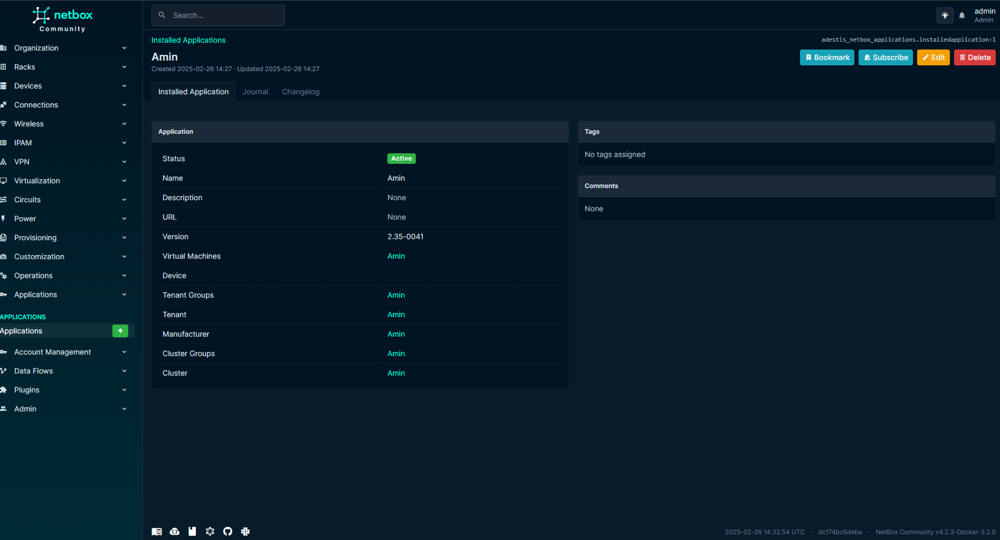
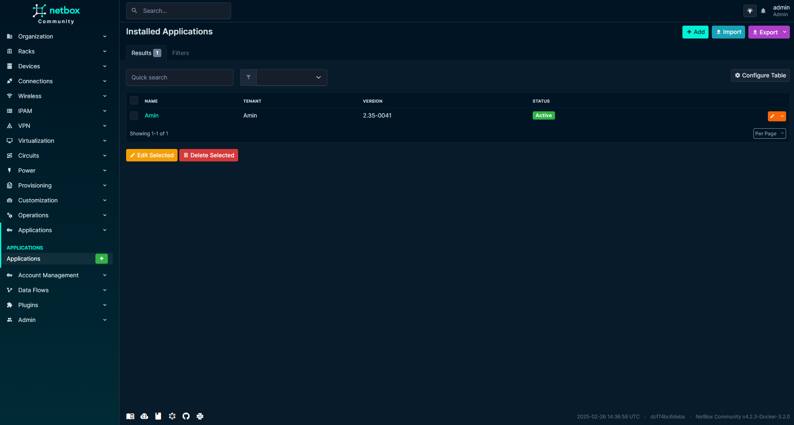

# Netbox Application Plugin

Netbox Plugin for Application related objects documentation.
## Features

This plugin provide following Model:
* Applications

## Compatibility

|               |           |
|---------------|-----------|
| NetBox 3.4.x  | >= 0.9.0  |


## Installation

The plugin is available as a Python package in pypi and can be installed with pip  

```
pip install netbox_cars
```
Enable the plugin in /etc/netbox/config/configuration.py:
```
PLUGINS = ['netbox_cars']
```
Restart NetBox and add `netbox_cars` to your local_requirements.txt

See [NetBox Documentation](https://docs.netbox.dev/en/stable/plugins/#installing-plugins) for details


## Screenshots

Applications


Applications
